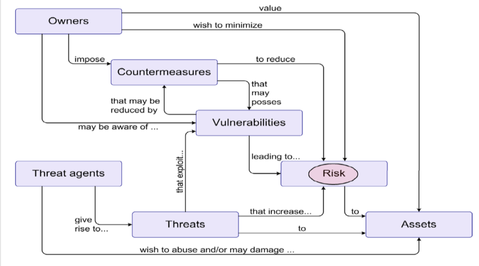
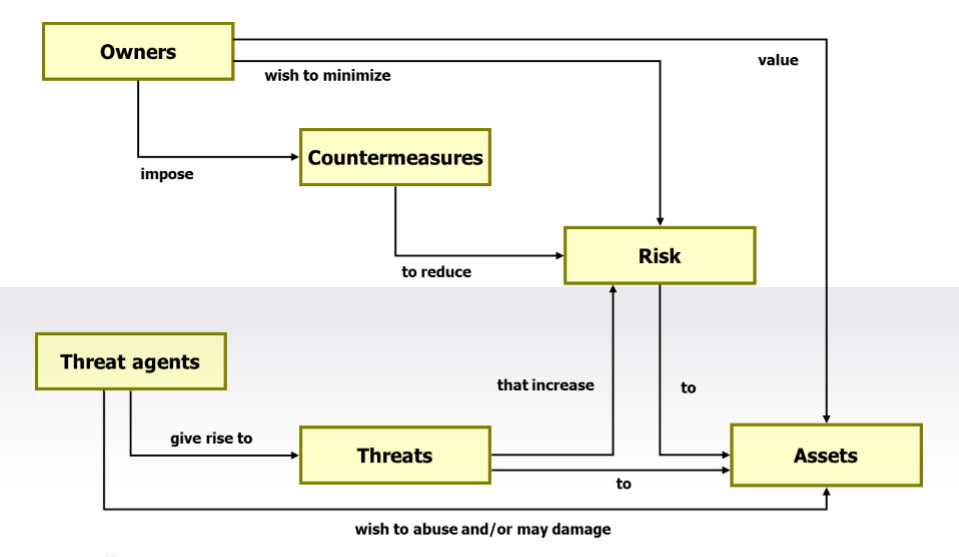
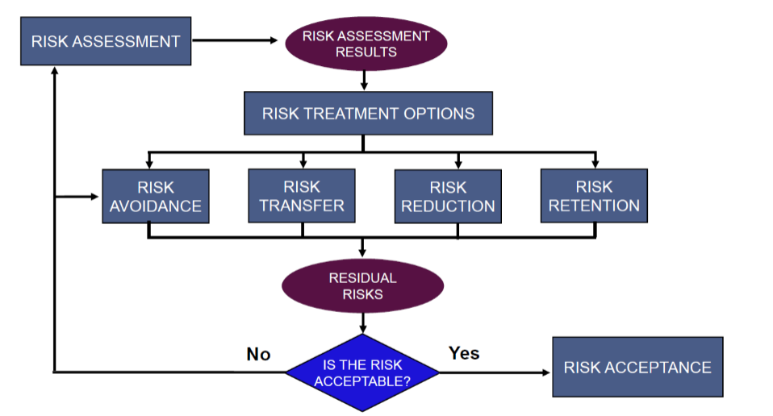
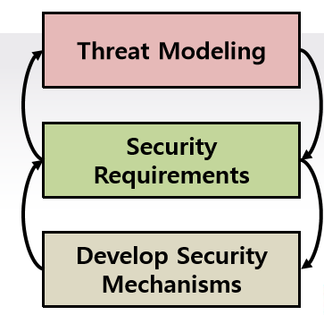
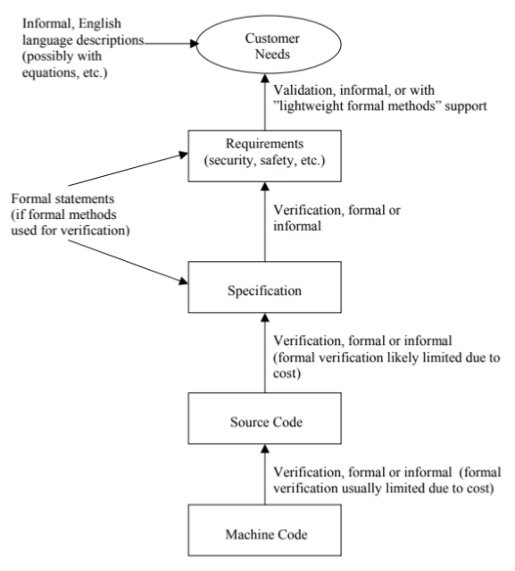
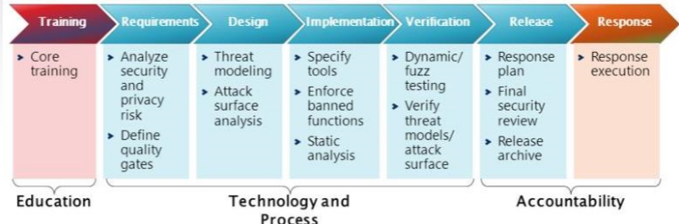
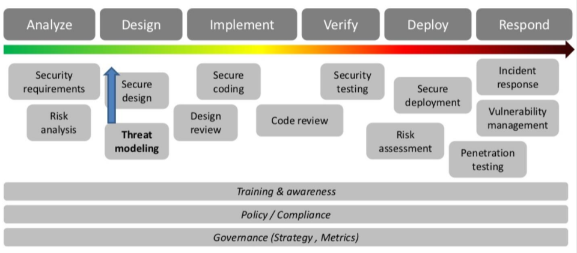

# The Basic Terms & Theories

 

## 1. 위협(Threats) vs. 위험(Risk)

 

### 1) The Security “Big Picture”

 

 

- Owners: 자산 및 시스템의 주인

- Countermeasures: 대응책

- Vulnerabilities: 취약점(자산의 잠재적인 속성으로서 위협의 이용 대상이 되는 것)

- Risk: 위험(위협에 따라 생길 수 있는 손실에 대한 가능성)

- Threat agents: 위협원(북한, 해커 등)

- Threats: 위협(손실이나 손상의 원인이 될 가능성을 제공하는 환경)

- Assets: 보호해야할 가치(value)를 지닌 자산

위험(risk)은 없애는 것이 아니라 ***줄이는 것(reduce)이다.***

 

### 2) Risk Treatment

 

Risk Treatment Options

- Risk Avoidance: 위험 자체를 피하는 것(e.g. 삼성 스마트TV 해킹 문제로 카메라 자체를 없애버림)
  
- Risk Transfer: 위험의 책임을 전가하는 것(e.g. 삼성페이 미국시장에서 토큰 만료 시간을 증가시켜 위험이 증가하여 보험에 가입함, 무언가 프로그램을 설치하거나 실행할 때 사용자에게 책임을 전가하는 경우)

- Risk Reduction: 일반적으로 엔지니어들이 위험을 줄이기 위해 사용하는 메커니즘(보안 프로그램 개발)

- Risk Retention: 위험이 감수할만하다고 판단되면, 그냥 그 위험을 안고가는 것

실제 기업을 운영할 때는 위의 ***4가지 방법을 다양하게 고려해야 한다.***

 

## 2. 보안공학(Security Engineering)

실수나 자연재해와 같은 오류와 의도적인 해킹 공격으로부터 Trustworthy(or Dependable)한 시스템을 개발하는 방법론에 관한 학문

Design, Implementation, Testing, Auditing, Adaptation을 위한 툴, 프로세스, 방법론을 포함한다.

### 1) 보안공학이 어려운 이유

- 단순히 오류가 자연적으로 랜덤하게 발생하는게 아니라 공격자에 의해 의도적으로 나타남

- 공격자는 가장 취약한 부분을 찾으려고함

- 보안공학은 매우 넓은 범위의 지식과 전문성이 필요함(암호학, 컴퓨터 보안, 전산학, 하드웨어 보안, 경제학, 심리학, 법 등)

 

### 2) 보안공학 원칙(Security Engineering Principle)

- 위험 기반 접근(risk based approach)
  
- 보안 요구사항은 구조화된 엔지니어링 프로세스(structured engineering process)에 의해 도출됨

 

- Threat Modeling

- Security Requirements

- Develop Security Mechanisms

 

### 3) 보증 레벨(Assurance Levels)

- Assurance는 시스템의 trustworthiness를 결정하는 매우 중요한 요소임

- informal evidence부터 rigorous mathematical evidence까지 다양한 레벨의 Assurance 가능

- Assurance는 시스템의 생명주기(life cycle)) 전 과정에서 필요함

물론 시스템의 보안성을 모두 `수학적으로 증명`(mathematical proofs)할 수 있으면 가장 좋지만, 현실적으로 불가능할 경우에는 매우 `잘 정의된 소프트웨어 개발 프로세스`(well-defined software development processes)를 따라야 한다.

다음은 `Microsoft`의 `SDL(Security Development Lifecycle)`이다.

 

### 4) SDL(Secure Development Lifecycle)

 

### 5) Secure Design Principles