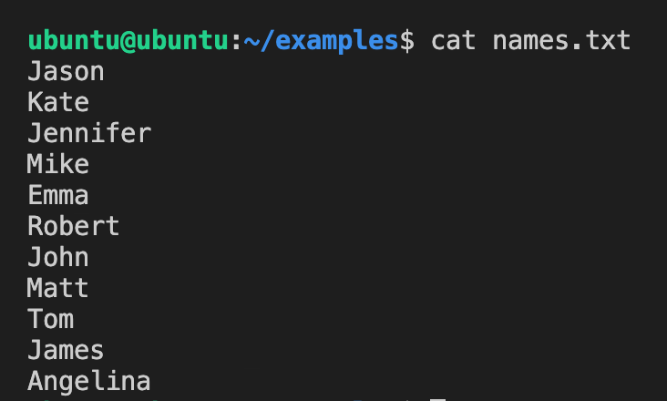

# 배쉬 파이프(Pipe) 명령어 설명 및 사용방법

<br/>

## 1. 설명

리눅스의 배쉬(Bash)는 다양한 기능과 명령어들을 제공한다. 오늘은 그 중에서도 **'파이프(Pipe)'** 또는 **|** 명령어에 대해서 알아본다. 배쉬는 CLI(Command Line Interface) 환경을 제공하는데 그것은 주로 어떤 명령의 출력을 다른 명령과 연결하기 위해 사용된다.

리눅스에서 모든 것은 파일이다. 그 얘기는 조금 이상하게 들리긴 하지만 사실이다. 쉘에서 실행되는 모든 명령들은 3가지 종류의 스트림을 갖게되는데 그것들은 어떤 명령으로부터 데이터를 출력하거나 다른 명령에게 데이터를 입력하기 위해 사용된다.

1) STDIN: **표준 입력(standard input)**은 명령의 입력을 읽어들이는 곳이다. 배쉬에서 디폴트는 배쉬 쉘(Bash Shell)이다.

2) STDOUT: **표준 출력(standard output)**은 명령의 출력을 쓰는 곳이다. 배쉬에서 디폴트는 일반적으로 배쉬 쉘(Bash Shell)이다.

3) STDERR: **표준 오류(standard error)**은 명령의 오류를 쓰는 곳이다.

파이프(Pipe) 명령어는 두 개 이상의 명령을 한 번에 사용할 수 있게 해주며, 한 명령의 출력이 그 다음 명령의 입력으로 사용되게 만든다. 다시 말해, 각 프로세스(process)의 출력은 파이프라인 안에서 다음 명령의 입력으로 직접(directly) 전달된다. 따라서 '|' 기호는 하나의 파이프(pipe)를 나타내는 것이다. 이것은 어떻게 보면 한 줄의 파이프라인(pipeline)에서 **각 명령은 필터(filter) 역할**을 하는 것이고, 각 필터를 거친 출력 데이터는 **연결된 파이프(pipe)를 통해 흘러서** 그 다음 필터(= 명령)에게 전달되는 것이라고 생각할 수 있다.

<br/>

## 2. 사용방법

파이프 명령어는 이전 명령의 표준 출력(STDOUT)을 ***'리다이렉트(redirect)'***하여 다음 명령의 표준 입력(STDIN)으로 전달한다. 사용 문법은 아래와 같다. **command1의 출력**은 **command2의 입력**으로 들어간다.

```console
command1 | command2
```

<br/>

## 3. 사용예제

### 1) cat 명령의 출력을 sort 명령의 입력으로 사용

이 예제에서는 우선은 다음과 같은 names.txt 파일을 준비한다.



<br/>

그리고 다음과 같이 cat 명령을 사용하여 names.txt 라는 파일을 출력한 다음 그 출력을 다시 sort 명령의 입력으로 전달한다.

```console
$ cat names.txt | sort
```


<br/>

### 2) 여러 개의 명령들을 파이프로 연결하기

이전 예제에서는 우리는 한 개의 파이프만 사용했지만 ***여러 개의 파이프를 사용***하여 다양한 명령들을 연결할 수도 있다.

다음과 같이 파이프로 연결하여 Grep 명령을 추가할 수 있다.

```console
$ cat names.txt | sort | grep "a"
```


<br/>

### 3) 파이프로 Grep 명령 여러 번 연결하기

이번 예제에서는 Grep 명령을 여러 번 연결하여 출력을 연속적으로 필터링 해보도록 한다.

```console
$ cat names.txt | grep "a" | grep "e"
```


<br/>

### 4) 파이프로 Less 명령 연결하기

이번 예제에서는 로그 파일에 대해 Grep 명령과 Less 명령을 파이프로 결합하여 결과를 확인해본다.

```console
$ cat /var/log/auth.log | grep sshd | less
```


<br/>


<br/>

---

### References

[1] *İsmail Baydan. (2018, Jan 25). [Linux Bash Pipe Command Usage with Examples For Redirection](https://www.poftut.com/linux-bash-pipe-command-usage-examples-redirection) [Web Blog]*

[2] *GURU99. (?). [Pipe, Grep and Sort Command in Linux/Unix with Examples](https://www.guru99.com/linux-pipe-grep.html) [Web Tutorial]*

